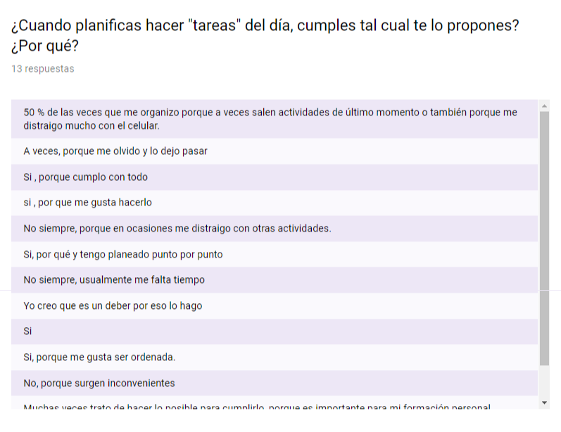

 # Reto Laboratoria
 
 Rediseña app con mejor en experiencia del calendario
Cuando sacamos una cita para el médico, compramos un pasaje de avión o de bus, hacemos una reserva para un hotel, programamos un viaje en Uber, nos creamos una cuenta en alguna página, reservamos un libro en una biblioteca, programamos un webinar, pagamos con una tarjeta de crédito, etc. interactuamos con un calendario para ingresar la fecha. La experiencia usando estos calendarios es variada, hay unos que están muy bien ajustados a lo que necesitamos (en algunos casos inmediatez, en otros seguridad o flexibilidad) y otras (varias) en los que terminan siendo una gran barrera para que un usuario termine de cumplir su objetivo y por el contrario, termina abandonando el producto.

Escoge un mercado, cualquiera de los mencionamos anteriormente, y encuentra cuál es la mejor manera de mostrar un calendario, tanto en desktop como en móvil.

# Flujo de trabajo:

## Research

De acuerdo a el reto, realicé unas preguntas virtuales y presenciales:

 
 
 
 
 

 
 
 
[Link de formulario virtual](https://docs.google.com/forms/d/e/1FAIpQLSeTgd95RYIAfDmhm-q5M6lp1c3HAoYI048Xqf5rkmrNTxwV7g/viewform)

## Síntesis
Mediante la técnica del Affinity Mapping podemos procesar de mejor manera los insights hallados en el research y pude llegar a encontrar los problemas.

# TEMAS ENCONTRADOS
    - Principales problemas por el que el usuario deja de utilizar el producto es:
        - "Porque no tengo un horario establecido"
        - "Por el trabajo"
        - "Por los inprevistos del día a día" 
        - "Porque no tengo espacio en mi celular"
        - "Porque me acuerdo y no necesito de un producto"

# SELECCIÓN DE TEMA
 ## PROBLEMA

 Muchas personas tienden a programarse, unos lo hacen en apuntes, en el calenadrio del mismo celular, block de notas, aplicaciones; sin embargo muchos dejan de hacerlo por el trabajo, los usuarios nos comentan que no tienen problema con la aplicación, que muchas veces les cuesta, por el horario no establecido, 
       
 # USER PERSON 

 # BECHMARCK
 

## STORITELLING
### Guión Literario

Emilio se siente estresado debido a su ajetreado horario laboral y horas de estudioen la universidad, más porque casi nunca puede cumplir con los tareas pendientes 
El anteriormente estuvo utilizando una aplicación que lo ayuda a organizarse, pero lamentablemente no ha podido concretarlos porque no calcula bien los tiempos, y se olvida muchas reuniones de trabajo.
Javier, un compañero de trabajo, le recomienda que utilice One calendar, le cuenta que es una buena herramienta para poder organizarse, Emilio duda pero finalmete la descarga y gracias a One Calendar Emilio está cumpliendo con todo lo que se propone

# ONE CALENDAR

One Calendar es una aplicación que te ayuda a mejor tu organización diaria, te comunica si te has olvidado alguna reunión, o si tienes que hacer un pago, tu la puedes manejar como totalmente se te sea cómodo.

## PAPER PROTOTYPING

## TESTING
    

# PROTIPO DE ALTA FINALIDAD

[Marvel](https://marvelapp.com/5j5jfgg/screen/44350544)

 